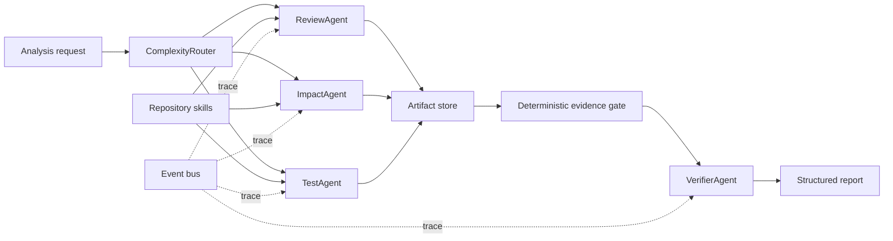

# RepoSentry

An independent, framework-free skeleton for an evidence-grounded multi-agent
pull request reviewer. It is designed as a resume project: the important Agent
mechanics are explicit in the code instead of being hidden behind LangGraph or
CrewAI.

The default `demo` model is deterministic and needs no API key. It exercises the
real routing, tool, event, evidence, verification, and report paths, but its
findings are placeholders.

## What is implemented

- A provider-neutral ReAct-style Agent loop.
- JSON Schema tool registry with per-Agent allowlists.
- Step, tool-call, token, timeout, and repeated-call budgets.
- Explainable `single` / `team` / `swarm` routing.
- Parallel specialist execution with bounded concurrency.
- Shared structured artifact storage.
- Deterministic evidence validation before LLM verification.
- `ReviewAgent`, `ImpactAgent`, `TestAgent`, and `VerifierAgent`.
- Read-only repository tools with path traversal protection.
- OpenAI Responses API and deterministic demo adapters.
- Async analysis jobs, event traces, CLI, and FastAPI endpoints.
- Core tests that run with Python's standard library.

## Architecture



## Project layout

```text
reposentry/
├── docs/MIGRATION_GUIDE.md
├── src/reposentry/
│   ├── adapters/          # LLM provider implementations
│   ├── api/               # FastAPI transport only
│   ├── domain/            # Provider-neutral models
│   ├── orchestration/     # Agents, router, verifier, fan-out/fan-in
│   ├── runtime/           # Agent loop, tools, budgets, events, context
│   ├── services/          # Jobs and dependency wiring
│   └── skills/            # Read-only repository capabilities
└── tests/
```

## Run without installing dependencies

The CLI and core tests intentionally avoid importing FastAPI, Pydantic, or the
OpenAI SDK.

```bash
cd reposentry
PYTHONPATH=src python3 -m unittest discover -s tests -v
PYTHONPATH=src python3 -m reposentry --repo .
```

The output contains:

- The route score, reasons, and selected Agents.
- Per-Agent step, tool-call, and token usage.
- Accepted findings and deterministically rejected findings.
- Verifier output.

## Run the API

```bash
cd reposentry
python3 -m venv .venv
source .venv/bin/activate
pip install -e '.[dev]'
uvicorn reposentry.api.app:app --reload --port 8000
```

Create a task:

```bash
curl -X POST http://127.0.0.1:8000/api/v1/analyses \
  -H 'Content-Type: application/json' \
  -d '{
    "repository_path": "/absolute/path/to/repository",
    "changed_files": ["src/auth.py", "tests/test_auth.py"],
    "additions": 180,
    "deletions": 30,
    "api_contract_changed": true,
    "sensitive_paths": ["src/auth.py"]
  }'
```

Then poll:

```text
GET /api/v1/analyses/{task_id}
GET /api/v1/analyses/{task_id}/events
```

## Use a real model

```bash
export REPOSENTRY_MODEL_PROVIDER=openai
export REPOSENTRY_MODEL_NAME=gpt-5-mini
export OPENAI_API_KEY=...
PYTHONPATH=src python3 -m reposentry --repo /absolute/path/to/repository
```

Do not commit API keys. For a remotely reachable API, also set
`REPOSENTRY_REPOSITORY_ROOT` so requests cannot analyze arbitrary host paths.

## Next milestones

1. GitHub App authentication, PR metadata, and shallow worktree checkout.
2. Tree-sitter symbols plus import/call graph.
3. BM25 + embeddings + RRF context selection.
4. Docker sandbox for tests and static analyzers.
5. SSE/WebSocket trace visualization.
6. PostgreSQL/Redis job and artifact persistence.
7. A labeled PR evaluation set and ablation dashboard.

See [the migration guide](docs/MIGRATION_GUIDE.md) before moving methods from
the existing project.

