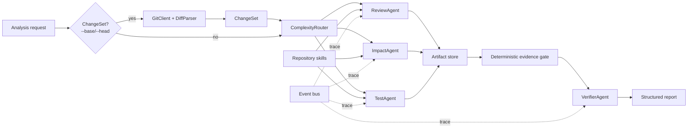

# RepoSentry

> **[中文版本 / Chinese version](README.zh-CN.md)**

An independent, framework-free skeleton for an evidence-grounded multi-agent
pull request reviewer. It is designed as a resume project: the important Agent
mechanics are explicit in the code instead of being hidden behind LangGraph or
CrewAI.

The default `demo` model is deterministic and needs no API key. It exercises the
real routing, tool, event, evidence, verification, and report paths, but its
findings are placeholders.

## What is implemented

- A provider-neutral ReAct-style Agent loop.
- JSON Schema tool registry with per-Agent allowlists.
- Step, tool-call, token, timeout, and repeated-call budgets.
- Explainable `single` / `team` / `swarm` routing with score-based complexity analysis.
- Two routing paths: legacy manual risk booleans and **ChangeSet-driven** (server-derived from Git diff).
- Parallel specialist execution with bounded concurrency.
- Shared structured artifact storage.
- Deterministic evidence validation before LLM verification.
- `ReviewAgent`, `ImpactAgent`, `TestAgent`, and `VerifierAgent`.
- Read-only Git skill: `DiffParser`, `GitClient`, ref validation, rename/binary handling.
- Read-only repository tools with path traversal protection.
- Path heuristic detectors: dependency manifests, API contracts, sensitive files.
- OpenAI Responses API and deterministic demo adapters.
- Async analysis jobs, event traces, CLI, and FastAPI endpoints.
- Core tests that run with Python's standard library.

## Architecture



### Routing

The `ComplexityRouter` assigns a score and selects agents:

| Score | Mode   | Agents                        |
|-------|--------|-------------------------------|
| < 4   | single | ReviewAgent                   |
| 4–8   | team   | ReviewAgent + ImpactAgent     |
| >= 9  | swarm  | ReviewAgent + ImpactAgent + TestAgent |

Two routing paths:

1. **Legacy (manual)**: scores from user-supplied `changed_files`, `additions`, `deletions`, and risk booleans.
2. **ChangeSet-driven** (`--base`/`--head` or API `base_revision`/`head_revision`): the router ignores manual flags and grounds its decision in actual Git diff data — file paths, line counts, and auto-detected dependency/API/sensitive flags.

### Evidence grounding

Every `Finding` must carry repository-relative `Evidence` (path + line range). The `EvidenceGate` verifies deterministically that:

- confidence is in [0, 1]
- evidence paths are well-formed (no absolute paths, no `..` traversal)
- evidence files exist within the repository root
- line numbers are within file bounds

Only grounded findings reach the LLM `VerifierAgent`. This check cannot be bypassed by the model.

## Project layout

```text
reposentry/
├── src/reposentry/
│   ├── adapters/          # LLM provider implementations
│   │   ├── demo.py        # Deterministic demo provider (no API key)
│   │   └── openai_responses.py
│   ├── api/               # FastAPI transport only
│   │   ├── app.py         # Health, analysis, event endpoints
│   │   └── schemas.py     # Pydantic request/response schemas
│   ├── domain/            # Provider-neutral models (no framework deps)
│   │   ├── models.py      # Finding, Evidence, AnalysisRequest, AnalysisReport
│   │   └── changes.py     # ChangeSet, ChangedFile, DiffHunk, path heuristics
│   ├── orchestration/     # Agents, router, verifier, fan-out/fan-in
│   │   ├── agents.py      # Agent specs (Review, Impact, Test, Verifier)
│   │   ├── router.py      # ComplexityRouter (legacy + ChangeSet-driven)
│   │   ├── orchestrator.py
│   │   └── verification.py # EvidenceGate
│   ├── runtime/           # Agent loop, tools, budgets, events, context
│   ├── services/          # Jobs and dependency wiring
│   │   ├── analysis.py    # AnalysisService: job lifecycle, wiring
│   │   └── revisions.py   # RevisionService: revision pair → ChangeSet
│   └── skills/            # Read-only repository & Git capabilities
│       ├── git.py         # GitClient, DiffParser, ref validation
│       └── repository.py  # list_files, read_file, search_code, git_diff
└── tests/
    ├── fixtures/diffs/    # Diff fixtures for offline parser testing
    ├── test_change_set.py
    ├── test_git_skill.py
    ├── test_orchestrator.py
    ├── test_repository_tools.py
    ├── test_revisions.py
    ├── test_router.py
    └── test_runtime.py
```

## Run without installing dependencies

The CLI and core tests intentionally avoid importing FastAPI, Pydantic, or the
OpenAI SDK.

```bash
cd reposentry
PYTHONPATH=src python3 -m unittest discover -s tests -v
PYTHONPATH=src python3 -m reposentry --repo .
```

With a real revision pair (ChangeSet-driven routing):

```bash
PYTHONPATH=src python3 -m reposentry --repo /path/to/repo --base main~3 --head main
```

The output contains:

- The route score, reasons, and selected Agents.
- Per-Agent step, tool-call, and token usage.
- Accepted findings and deterministically rejected findings.
- Verifier output.

## Run the API

```bash
cd reposentry
python3 -m venv .venv
source .venv/bin/activate
pip install -e '.[dev]'
uvicorn reposentry.api.app:app --reload --port 8000
```

Create a task (legacy manual mode):

```bash
curl -X POST http://127.0.0.1:8000/api/v1/analyses \
  -H 'Content-Type: application/json' \
  -d '{
    "repository_path": "/absolute/path/to/repository",
    "changed_files": ["src/auth.py", "tests/test_auth.py"],
    "additions": 180,
    "deletions": 30,
    "api_contract_changed": true,
    "sensitive_paths": ["src/auth.py"]
  }'
```

Create a task (ChangeSet-driven mode):

```bash
curl -X POST http://127.0.0.1:8000/api/v1/analyses \
  -H 'Content-Type: application/json' \
  -d '{
    "repository_path": "/absolute/path/to/repository",
    "base_revision": "main~5",
    "head_revision": "main"
  }'
```

Then poll:

```text
GET /api/v1/analyses/{task_id}
GET /api/v1/analyses/{task_id}/events
```

## Use a real model

```bash
export REPOSENTRY_MODEL_PROVIDER=openai
export REPOSENTRY_MODEL_NAME=gpt-5-mini
export OPENAI_API_KEY=...
PYTHONPATH=src python3 -m reposentry --repo /absolute/path/to/repository --base main~3 --head main
```

Do not commit API keys. For a remotely reachable API, also set
`REPOSENTRY_REPOSITORY_ROOT` so requests cannot analyze arbitrary host paths.

## Settings

| Environment variable | Default | Description |
|---|---|---|
| `REPOSENTRY_MODEL_PROVIDER` | `demo` | `demo` or `openai` |
| `REPOSENTRY_MODEL_NAME` | `gpt-5-mini` | Model identifier |
| `OPENAI_API_KEY` | — | Required when provider is `openai` |
| `REPOSENTRY_MAX_PARALLEL_AGENTS` | `3` | Max concurrent specialist agents |
| `REPOSENTRY_REPOSITORY_ROOT` | — | Optional containment root for security |

## Next milestones

1. GitHub App authentication, PR metadata, and shallow worktree checkout.
2. Tree-sitter symbols plus import/call graph.
3. BM25 + embeddings + RRF context selection.
4. Docker sandbox for tests and static analyzers.
5. SSE/WebSocket trace visualization.
6. PostgreSQL/Redis job and artifact persistence.
7. A labeled PR evaluation set and ablation dashboard.

See [the migration guide](docs/MIGRATION_GUIDE.md) before moving methods from
the existing project.
