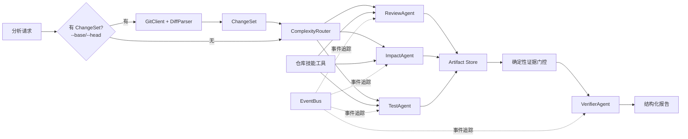

# RepoSentry

> **[English version](README.md)**

一个独立的、不依赖框架的多 Agent PR 审查骨架项目。设计为简历展示项目：核心 Agent 机制在代码中显式实现，而非隐藏在 LangGraph 或 CrewAI 等框架背后。

默认的 `demo` 模型是确定性的，无需 API Key。它会走完完整的路由、工具调用、事件、证据验证和报告流程，但产出的 findings 为占位内容。

## 已实现功能

- Provider 无关的 ReAct 风格 Agent 循环
- JSON Schema 工具注册表，支持按 Agent 配置工具白名单
- 步数、工具调用次数、Token 数、超时、重复调用的预算控制
- 可解释的 `single` / `team` / `swarm` 路由，基于评分的复杂度分析
- 两种路由路径：Legacy 手动标记 和 **ChangeSet 驱动**（从 Git diff 服务端推导）
- 并行专家执行，有界并发
- 结构化共享 Artifact 存储
- LLM 验证前的确定性证据门控
- `ReviewAgent`、`ImpactAgent`、`TestAgent`、`VerifierAgent` 四类 Agent
- 只读 Git 技能：`DiffParser`、`GitClient`、ref 校验、重命名/二进制文件处理
- 只读仓库工具，带路径遍历防护
- 路径启发式检测：依赖清单、API 契约、敏感文件
- OpenAI Responses API 适配器和确定性 demo 适配器
- 异步分析作业、事件追踪、CLI 和 FastAPI 端点
- 核心测试仅依赖 Python 标准库即可运行

## 架构



### 路由机制

`ComplexityRouter` 根据评分选择 Agent 组合：

| 评分 | 模式 | Agent 组合 |
|------|------|-----------|
| < 4 | single | ReviewAgent |
| 4–8 | team | ReviewAgent + ImpactAgent |
| >= 9 | swarm | ReviewAgent + ImpactAgent + TestAgent |

两种路由路径：

1. **Legacy（手动模式）**：基于用户传入的 `changed_files`、`additions`、`deletions` 和风险布尔值评分
2. **ChangeSet 驱动**（`--base`/`--head` 或 API 的 `base_revision`/`head_revision`）：路由器忽略手动标记，基于实际 Git diff 数据（文件路径、行数、自动检测的依赖/API/敏感标记）做决策

### 证据门控

每个 `Finding` 必须携带仓库相对路径的 `Evidence`（路径 + 行范围）。`EvidenceGate` 会做确定性验证：

- confidence 在 [0, 1] 范围内
- evidence 路径格式合法（无绝对路径、无 `..` 遍历）
- evidence 文件存在于仓库根目录内
- 行号在文件有效范围内

只有通过门控的 findings 才会送入 LLM `VerifierAgent`。此检查不可被模型绕过。

## 项目结构

```text
reposentry/
├── src/reposentry/
│   ├── adapters/          # LLM Provider 实现
│   │   ├── demo.py        # 确定性 demo provider（无需 API Key）
│   │   └── openai_responses.py
│   ├── api/               # FastAPI 传输层（薄层）
│   │   ├── app.py         # 健康检查、分析、事件端点
│   │   └── schemas.py     # Pydantic 请求/响应 schema
│   ├── domain/            # Provider 无关的领域模型（无框架依赖）
│   │   ├── models.py      # Finding, Evidence, AnalysisRequest, AnalysisReport
│   │   └── changes.py     # ChangeSet, ChangedFile, DiffHunk, 路径启发式检测
│   ├── orchestration/     # Agent 定义、路由、验证、扇出/扇入
│   │   ├── agents.py      # Agent 规格（Review, Impact, Test, Verifier）
│   │   ├── router.py      # ComplexityRouter（Legacy + ChangeSet 驱动）
│   │   ├── orchestrator.py
│   │   └── verification.py # EvidenceGate
│   ├── runtime/           # Agent 循环、工具、预算、事件、上下文
│   ├── services/          # 作业管理和依赖装配
│   │   ├── analysis.py    # AnalysisService: 作业生命周期、组件装配
│   │   └── revisions.py   # RevisionService: revision pair → ChangeSet
│   └── skills/            # 只读仓库 & Git 能力
│       ├── git.py         # GitClient, DiffParser, ref 校验
│       └── repository.py  # list_files, read_file, search_code, git_diff
└── tests/
    ├── fixtures/diffs/    # 离线 parser 测试用的 diff 固定文件
    ├── test_change_set.py
    ├── test_git_skill.py
    ├── test_orchestrator.py
    ├── test_repository_tools.py
    ├── test_revisions.py
    ├── test_router.py
    └── test_runtime.py
```

## 无依赖运行

CLI 和核心测试刻意避免导入 FastAPI、Pydantic 或 OpenAI SDK。

```bash
cd reposentry
PYTHONPATH=src python3 -m unittest discover -s tests -v
PYTHONPATH=src python3 -m reposentry --repo .
```

使用真实 revision pair（ChangeSet 驱动路由）：

```bash
PYTHONPATH=src python3 -m reposentry --repo /path/to/repo --base main~3 --head main
```

输出包含：

- 路由评分、评分原因、选中的 Agent
- 每个 Agent 的步数、工具调用次数、Token 用量
- 被接受的 findings 和被确定性拒绝的 findings
- Verifier 输出

## 运行 API 服务

```bash
cd reposentry
python3 -m venv .venv
source .venv/bin/activate
pip install -e '.[dev]'
uvicorn reposentry.api.app:app --reload --port 8000
```

创建分析任务（Legacy 手动模式）：

```bash
curl -X POST http://127.0.0.1:8000/api/v1/analyses \
  -H 'Content-Type: application/json' \
  -d '{
    "repository_path": "/absolute/path/to/repository",
    "changed_files": ["src/auth.py", "tests/test_auth.py"],
    "additions": 180,
    "deletions": 30,
    "api_contract_changed": true,
    "sensitive_paths": ["src/auth.py"]
  }'
```

创建分析任务（ChangeSet 驱动模式）：

```bash
curl -X POST http://127.0.0.1:8000/api/v1/analyses \
  -H 'Content-Type: application/json' \
  -d '{
    "repository_path": "/absolute/path/to/repository",
    "base_revision": "main~5",
    "head_revision": "main"
  }'
```

轮询结果：

```text
GET /api/v1/analyses/{task_id}
GET /api/v1/analyses/{task_id}/events
```

## 使用真实模型

```bash
export REPOSENTRY_MODEL_PROVIDER=openai
export REPOSENTRY_MODEL_NAME=gpt-5-mini
export OPENAI_API_KEY=...
PYTHONPATH=src python3 -m reposentry --repo /absolute/path/to/repository --base main~3 --head main
```

请勿提交 API Key。对于远程可访问的 API，建议同时设置 `REPOSENTRY_REPOSITORY_ROOT` 以防止请求分析任意主机路径。

## 配置项

| 环境变量 | 默认值 | 说明 |
|---|---|---|
| `REPOSENTRY_MODEL_PROVIDER` | `demo` | `demo` 或 `openai` |
| `REPOSENTRY_MODEL_NAME` | `gpt-5-mini` | 模型标识 |
| `OPENAI_API_KEY` | — | Provider 为 `openai` 时必填 |
| `REPOSENTRY_MAX_PARALLEL_AGENTS` | `3` | 最大并行专家 Agent 数 |
| `REPOSENTRY_REPOSITORY_ROOT` | — | 可选的安全仓库根目录限制 |

## 后续里程碑

1. GitHub App 认证、PR 元数据、浅克隆 worktree
2. Tree-sitter 符号提取 + import/call 图
3. BM25 + embeddings + RRF 上下文选择
4. Docker 沙箱运行测试和静态分析
5. SSE/WebSocket 事件追踪可视化
6. PostgreSQL/Redis 作业和 Artifact 持久化
7. 标注 PR 评估集和消融实验仪表板

迁移现有项目代码前请参阅[迁移指南](docs/MIGRATION_GUIDE.md)。
